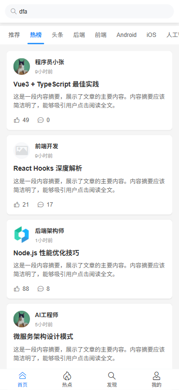
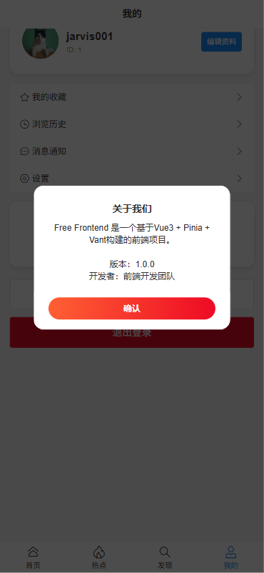

# Free Frontend

基于 Vue3 + Pinia + Vant + JavaScript 的纯前端演示项目


## 🎯 项目特点

- **纯前端演示**: 需配合后端服务，(https://github.com/wjwdive/FreeBackend)
- **现代化技术栈**: Vue3 + Pinia + Vant
- **移动端优先**: 响应式设计，完美适配移动设备
- **演示模式**: 模拟用户注册/登录流程
- **后端** localhost:3001/
- **前端** localhost:3000/

## 🛠 技术栈

- **框架**: Vue 3.4.0
- **路由**: Vue Router 4.2.5
- **状态管理**: Pinia 2.1.7
- **UI组件库**: Vant 4.8.2
- **构建工具**: Vite 5.0.0

## 📁 项目结构

```
FreeFrontend/
├── src/                    # 源代码目录
│   ├── components/         # 公共组件
│   │   ├── Loading.vue    # 加载组件
│   │   └── index.js       # 组件索引
│   ├── router/            # 路由配置
│   │   └── index.js      # 路由配置文件
│   ├── services/          # API服务
│   │   └── api.js         # API接口封装
│   ├── stores/            # 状态管理
│   │   └── user.js       # 用户状态管理
│   ├── utils/             # 工具函数
│   │   └── testConnection.js # 连接测试工具
│   ├── views/             # 页面组件
│   │   ├── Login.vue      # 登录页面
│   │   ├── Register.vue   # 注册页面
│   │   ├── MainLayout.vue # 主布局（底部导航）
│   │   ├── Home.vue       # 首页（内容展示）
│   │   ├── Hot.vue        # 热点页面
│   │   ├── Discover.vue  # 发现页面
│   │   ├── Profile.vue   # 个人中心页面
│   │   └── ConnectionTest.vue # 连接测试页面
│   ├── App.vue            # 根组件
│   └── main.js            # 入口文件
├── dist/                  # 构建输出目录
├── node_modules/          # 依赖包目录
├── .env.development       # 开发环境配置
├── vite.config.js         # Vite配置文件
├── package.json           # 项目配置和依赖
├── index.html             # HTML模板
└── README.md              # 项目说明文档
```

## ✨ 功能特性

### 🔐 用户认证
- ✅ 用户注册功能（连接真实后端API）
- ✅ 用户登录功能（支持多种响应格式）
- ✅ 路由守卫和权限控制
- ✅ 状态持久化（localStorage）

### 📱 页面功能
- ✅ 底部导航栏（首页、热点、发现、我的）
- ✅ 首页内容展示（搜索框 + 分类标签 + 内容列表）
- ✅ 热点页面（热门内容展示）
- ✅ 发现页面（内容探索）
- ✅ 个人中心页面（用户信息管理）
- ✅ 连接测试页面（API连通性测试）

### 🎨 界面特色
- ✅ 响应式设计和移动端适配
- ✅ 美观的UI界面和交互动画
- ✅ 渐变背景和卡片式布局
- ✅ 下拉刷新和上拉加载更多
- ✅ 分类标签左右滑动切换

## 🚀 快速开始

### 方式一：使用HTTP服务器（推荐）

```bash
# 使用任何静态文件服务器
npx serve dist
# 或
python -m http.server 3000 --directory dist
# 或直接打开 dist/index.html
```

### 方式二：开发模式（需要解决依赖安装）

```bash
npm install
npm run dev
```

### 构建生产版本

```bash
npm run build
```

构建后的文件位于 `dist/` 目录。

## 🎮 使用说明

### 完整使用流程

1. **访问应用**: 打开 http://localhost:3000 自动跳转到登录页
2. **注册账号**: 填写用户名、邮箱、密码进行注册（连接真实后端API）
3. **登录系统**: 使用注册的用户名密码登录
4. **进入首页**: 登录成功后进入主布局页面，默认显示首页tab
5. **浏览内容**: 在首页可以：
   - 使用顶部搜索框搜索内容
   - 左右滑动切换分类标签（推荐、热榜、头条、后端、前端等）
   - 浏览内容列表，查看用户头像、昵称、标题、摘要
   - 点赞和评论内容
   - 下拉刷新和上拉加载更多内容
6. **切换页面**: 通过底部导航栏切换不同页面：
   - **首页**: 内容展示和浏览
   - **热点**: 热门内容推荐
   - **发现**: 内容探索和发现
   - **我的**: 个人中心和管理

### 功能说明

- **注册功能**: 连接真实后端API，支持用户注册
- **登录功能**: 支持多种API响应格式，智能适配后端接口
- **底部导航**: 完整的4个tab页面切换
- **首页功能**: 完整的搜索、分类、内容展示功能
- **状态持久化**: 刷新页面后保持登录状态
- **响应式设计**: 完美适配手机、平板、桌面设备

## 🎨 界面特色

- **渐变背景**: 现代化的渐变色彩设计
- **卡片布局**: 清晰的卡片式界面布局
- **交互动画**: 流畅的页面切换和按钮动画
- **移动优化**: 针对移动设备的触摸优化

## 📱 访问方式

直接打开 `dist/index.html` 或部署到任意静态文件服务器。

## 🔧 技术亮点

- **Vue3组合式API**: 现代化的组件开发方式
- **Pinia状态管理**: 简单高效的状态管理方案
- **Vant组件库**: 专业的移动端UI组件

## 💡 注意事项

- 本项目为纯前端演示，所有数据存储在浏览器本地
- 刷新页面或清除缓存后数据会重置
- 如需连接真实后端服务，可参考原始代码结构进行扩展

## 📄 许可证
    MIT License
     Copyright (c) 2025 wjwdive
     Permission is hereby granted, free of charge, to any person obtaining a copy of this software and associated documentation files (the "Software"), to deal in the Software without restriction, including without limitation the rights to use, copy, modify, merge, publish, distribute, sublicense, and/or sell copies of the Software, and to permit persons to whom the Software is furnished to do so, subject to the following conditions: